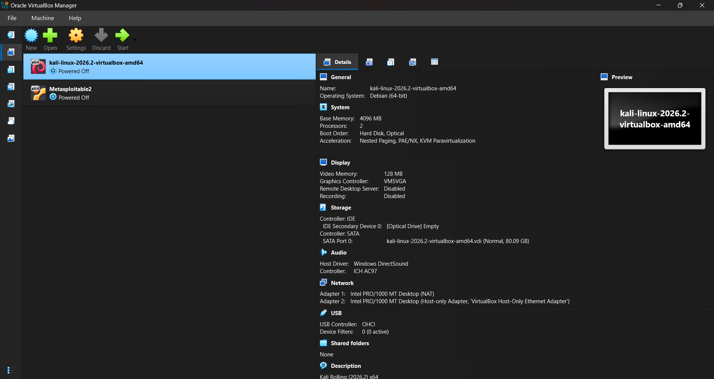
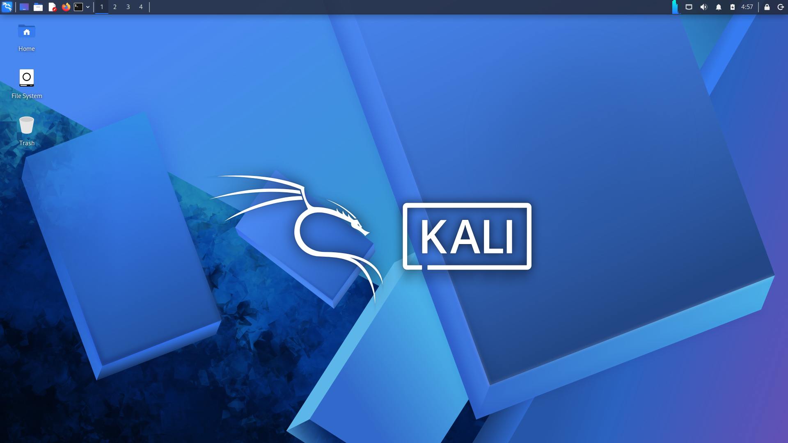
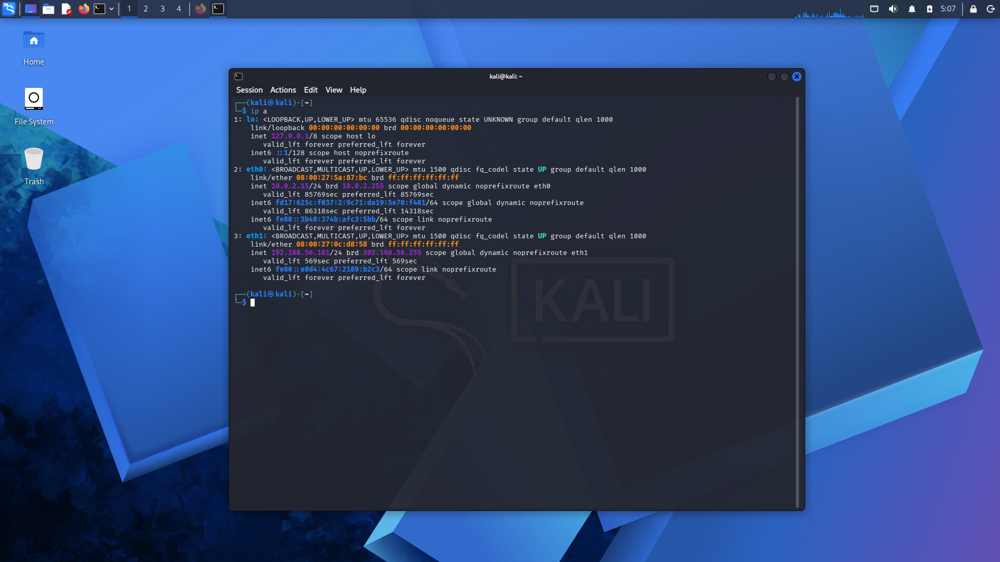
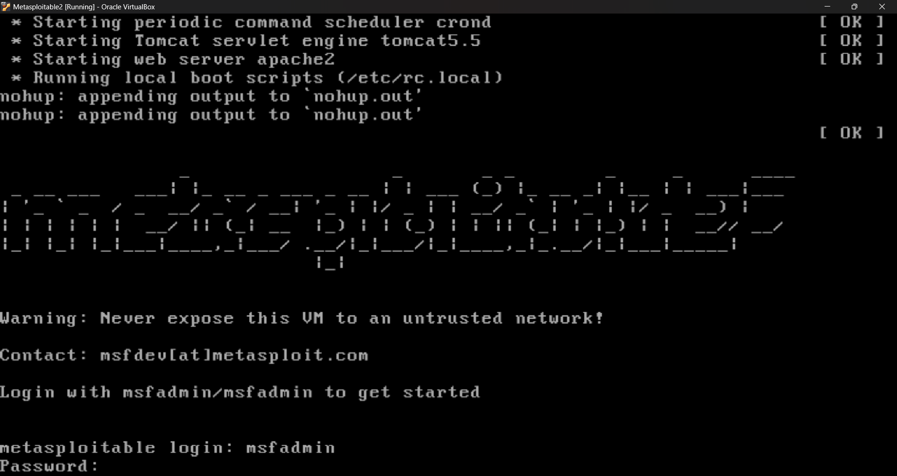
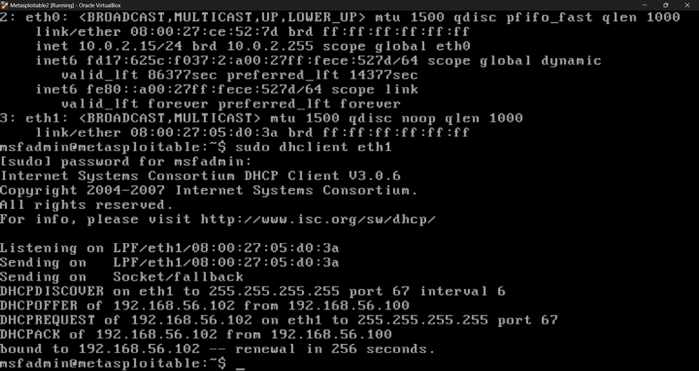
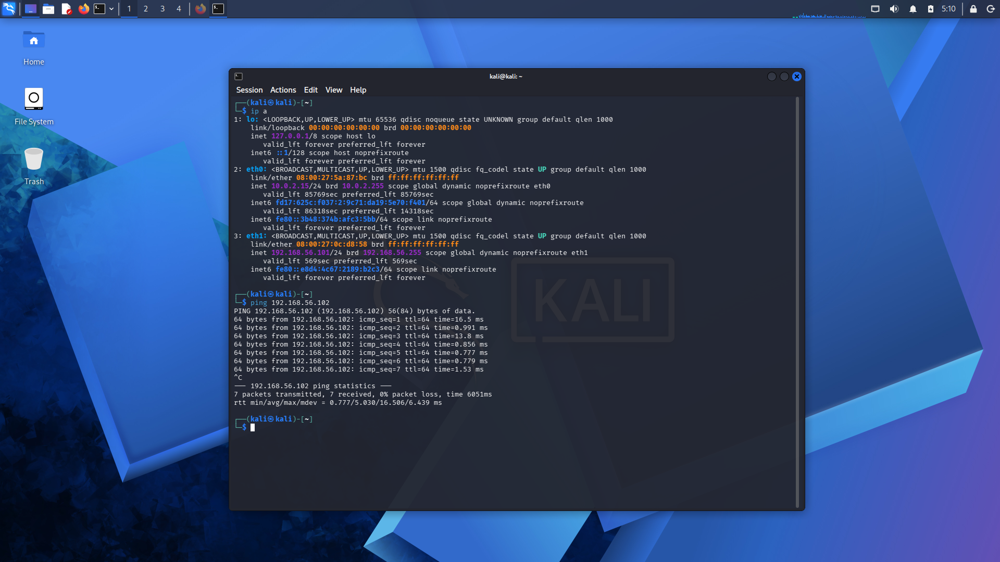
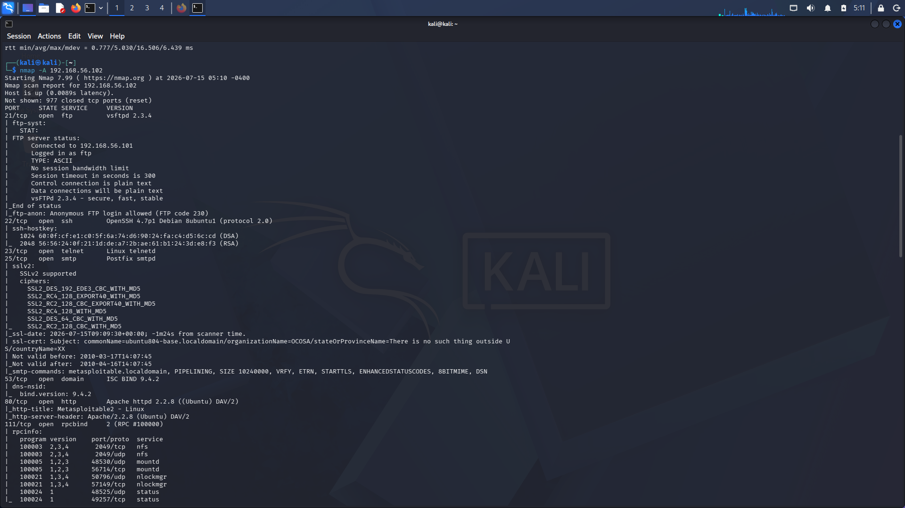
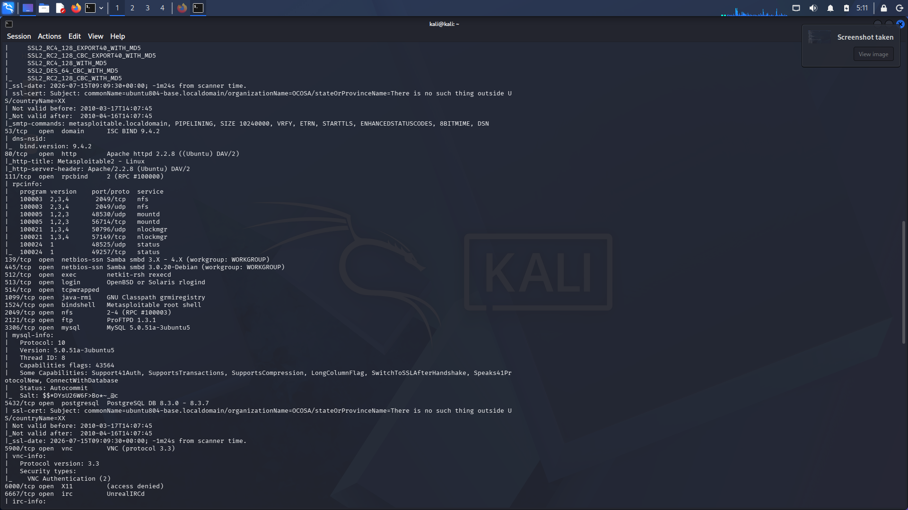
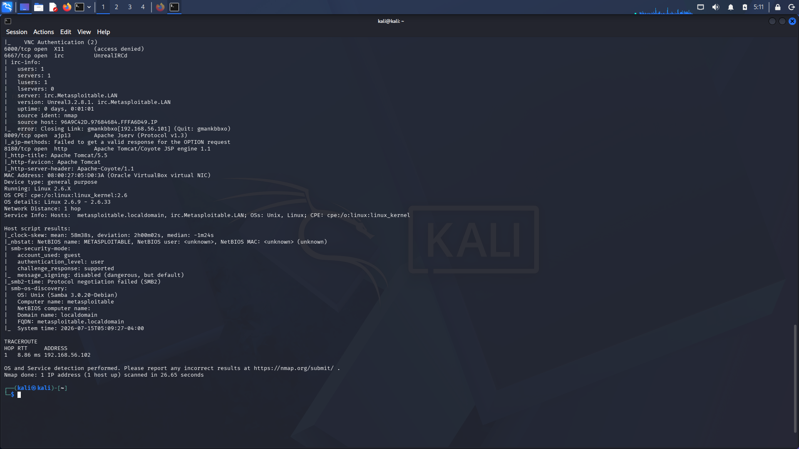

<p align="center">
  
</p>

<h1 align="center">Cybersecurity-Task1</h1>
<h3 align="center">Task 1 - Foundation & Environment Setup</h3>

<p align="center">
  <a href="https://github.com/Adarsh130"></a>
  
  
  
  
</p>

---

## Internship Information

| Field | Details |
|---|---|
| Internship | Cybersecurity Internship |
| Organization | ApexPlanet Software Pvt. Ltd. |
| Task | Task 1 - Foundation & Environment Setup |
| Repository | Cybersecurity-Task1 |
| Author | Adarsh Paswan |
| Email | adarshpaswan1106@gmail.com |
| GitHub | [Adarsh130](https://github.com/Adarsh130) |
| LinkedIn | [adarsh1306](https://www.linkedin.com/in/adarsh1306) |

## Project Status

| Area | Status | Evidence |
|---|---:|---|
| VirtualBox installed | Complete | Screenshot 01 |
| Kali Linux configured | Complete | Screenshots 02 and 03 |
| Metasploitable2 configured | Complete | Screenshots 04 and 05 |
| Host-only network configured | Complete | IP verification and ping test |
| Connectivity tested | Complete | Screenshot 06 |
| Nmap reconnaissance performed | Complete | Screenshots 07, 08, and 09 |
| Documentation completed | Complete | README, docs, and PDF report |

## Table of Contents

- [Project Overview](#project-overview)
- [Objectives](#objectives)
- [Features](#features)
- [Lab Environment](#lab-environment)
- [Tools & Technologies](#tools-technologies)
- [Software Used](#software-used)
- [Architecture Diagram](#architecture-diagram)
- [Network Diagram](#network-diagram)
- [Workflow Diagram](#workflow-diagram)
- [Installation Guide](#installation-guide)
- [VirtualBox Installation](#virtualbox-installation)
- [Kali Linux Installation](#kali-linux-installation)
- [Metasploitable2 Installation](#metasploitable2-installation)
- [Virtual Network Configuration](#virtual-network-configuration)
- [Host-Only Networking](#hostonly-networking)
- [Commands Used](#commands-used)
- [Nmap Scan](#nmap-scan)
- [Port Analysis](#port-analysis)
- [Security Risks](#security-risks)
- [Screenshots](#screenshots)
- [Skills Demonstrated](#skills-demonstrated)
- [Challenges Faced](#challenges-faced)
- [Solutions](#solutions)
- [Learning Outcomes](#learning-outcomes)
- [Best Practices](#best-practices)
- [Repository Structure](#repository-structure)
- [Documentation Links](#documentation-links)
- [Future Scope](#future-scope)
- [FAQ](#faq)
- [References](#references)
- [Author](#author)
- [Contact](#contact)
- [License](#license)
- [Acknowledgements](#acknowledgements)

## Project Overview

This repository documents the successful creation of a local penetration testing laboratory using Oracle VirtualBox, Kali Linux, and Metasploitable2. The lab is intentionally isolated through a VirtualBox host-only network so that scanning and testing activities remain inside a controlled environment.

The project focuses on foundational skills: installing virtual machines, assigning network adapters, validating IP addresses, confirming reachability with ICMP, and performing reconnaissance with Nmap. These actions form the beginning of a responsible penetration testing workflow because every later activity depends on accurate environment setup and careful target verification.

The target machine, Metasploitable2, is intentionally vulnerable and should never be exposed to a bridged, public, office, or production network. It is used here only as a legal training target inside a private lab owned and controlled by the learner.

## Objectives

- Install Oracle VirtualBox as the virtualization platform.
- Deploy Kali Linux as the attacker and analysis workstation.
- Deploy Metasploitable2 as a vulnerable Linux target.
- Configure both virtual machines on a host-only adapter.
- Verify IP address assignment on both systems.
- Confirm network connectivity using ping.
- Run Nmap scans to identify open ports and services.
- Document the setup with screenshots, commands, and analysis.
- Build a clean GitHub repository suitable for internship evaluation.
- Practice ethical boundaries for cybersecurity lab work.

## Features

- Complete lab setup documentation from installation to reconnaissance.
- Dedicated Linux command cheat sheet for repeatable terminal work.
- Networking guide covering OSI, TCP/IP, addressing, routing, NAT, and host-only networking.
- Command reference explaining syntax, purpose, output, troubleshooting, and security notes.
- Nmap analysis document with port-level risk discussion and mitigation guidance.
- Embedded screenshots for visual proof of task completion.
- Repository structure aligned with professional GitHub documentation practices.
- Valid report PDF for submission and archival.

## Lab Environment

| Component | Configuration | Purpose |
|---|---|---|
| Host System | Windows workstation | Runs VirtualBox and stores repository evidence |
| Hypervisor | Oracle VirtualBox | Provides virtual machine isolation |
| Attacker VM | Kali Linux | Runs terminal, ping, and Nmap |
| Target VM | Metasploitable2 | Intentionally vulnerable system for scanning |
| Network Mode | Host-only Adapter | Keeps lab traffic isolated from external networks |
| Example Subnet | 192.168.56.0/24 | Private lab address space |
| Scanner | Nmap | Discovers hosts, ports, services, and versions |

## Tools & Technologies

- Oracle VirtualBox
- Kali Linux
- Metasploitable2
- Linux terminal
- Nmap
- ICMP ping
- Host-only networking
- Markdown
- Git and GitHub

## Software Used

| Software | Role | Notes |
|---|---|---|
| Oracle VirtualBox | Virtualization | Used to create and run lab VMs |
| Kali Linux | Security workstation | Includes penetration testing tools |
| Metasploitable2 | Vulnerable target | Legal target for training only |
| Nmap | Reconnaissance | Used for host and service discovery |
| GitHub | Documentation platform | Hosts project files and evidence |

## Architecture Diagram

```text
Cybersecurity-Task1 Lab

+-------------------------------------------------------------+
| Host Operating System                                       |
|                                                             |
|  +---------------- Oracle VirtualBox --------------------+  |
|  |                                                       |  |
|  |  +----------------+        +-----------------------+  |  |
|  |  | Kali Linux     |        | Metasploitable2       |  |  |
|  |  | Attacker VM    |        | Vulnerable Target VM  |  |  |
|  |  | Nmap + Shell   |        | Training Services     |  |  |
|  |  +----------------+        +-----------------------+  |  |
|  |            \                    /                       |  |
|  |             \ Host-Only Adapter /                        |  |
|  |              +----------------+                          |  |
|  +-------------------------------------------------------+  |
+-------------------------------------------------------------+
```

## Network Diagram

```text
Example Host-Only Network: 192.168.56.0/24

               VirtualBox Host-Only Adapter
                         192.168.56.1
                               |
             +-----------------+-----------------+
             |                                   |
     Kali Linux VM                       Metasploitable2 VM
     192.168.56.101                      192.168.56.102
     Scanner                             Target
             |                                   |
             +----------- ICMP / TCP ------------+
```

## Workflow Diagram

```text
Download tools
     |
Install VirtualBox
     |
Import Kali Linux and Metasploitable2
     |
Attach both VMs to Host-Only Adapter
     |
Boot VMs and verify IP addresses
     |
Ping target from Kali
     |
Run Nmap scan
     |
Document ports, services, risks, and evidence
```

## Installation Guide

The installation process should be performed on a machine with enough CPU, RAM, and disk capacity to run two virtual machines at the same time. A stable host system prevents false troubleshooting caused by resource exhaustion.

Recommended minimum host resources:

| Resource | Suggested Minimum | Recommended |
|---|---:|---:|
| CPU | 2 cores | 4 or more cores |
| RAM | 8 GB | 16 GB or more |
| Disk Space | 40 GB free | 80 GB or more free |
| Network | Local only | Host-only adapter for lab traffic |

## VirtualBox Installation

1. Download Oracle VirtualBox from the official VirtualBox website.
2. Run the installer with the default feature set.
3. Allow the VirtualBox network drivers to be installed when prompted.
4. Open VirtualBox Manager after installation.
5. Confirm that a host-only adapter exists under network settings.
6. Create one if it is missing, using a private range such as 192.168.56.0/24.

## Kali Linux Installation

1. Download the Kali Linux VirtualBox image or ISO from the official Kali website.
2. Import the appliance or create a new VM from the ISO.
3. Assign sufficient RAM and CPU resources.
4. Attach Adapter 1 to the Host-only Adapter for the lab segment.
5. Boot Kali Linux and log in.
6. Open a terminal and verify the IP address with `ip a`.
7. Update package repositories if internet access is temporarily enabled through a separate adapter.

## Metasploitable2 Installation

1. Download the Metasploitable2 virtual machine from a trusted training source.
2. Extract the archive to a controlled lab directory.
3. Create or import the VM in VirtualBox using the existing virtual disk.
4. Attach its network adapter to the same Host-only Adapter as Kali.
5. Boot the VM and log in with the provided training credentials.
6. Run `ip a` or `ifconfig` to confirm the target IP address.
7. Keep this VM isolated because it contains intentionally vulnerable services.

## Virtual Network Configuration

Both virtual machines must share the same host-only network. This allows Kali Linux to communicate with Metasploitable2 while preventing the vulnerable target from being exposed to the internet or other physical network devices.

| Setting | Kali Linux | Metasploitable2 |
|---|---|---|
| Adapter Type | Host-only Adapter | Host-only Adapter |
| Network Name | VirtualBox host-only network | VirtualBox host-only network |
| Example IP | 192.168.56.101 | 192.168.56.102 |
| Subnet Mask | 255.255.255.0 | 255.255.255.0 |
| Internet Exposure | Not required | Not allowed |

## Host-Only Networking

Host-only networking creates a private network between the host and selected virtual machines. It is appropriate for this lab because the target machine is vulnerable by design. The network provides enough connectivity for scanning, ping testing, and service enumeration without placing the target on an unsafe network segment.

Key benefits:

- Limits scan traffic to the local virtualization environment.
- Reduces risk of exposing vulnerable services.
- Makes IP addressing predictable for documentation.
- Supports repeatable testing without depending on external network availability.
- Allows the host to observe or manage lab systems if needed.

## Commands Used

The core commands used in this project are summarized below. Detailed explanations are available in [Commands_Used.md](docs/Commands_Used.md).

| Command | Purpose |
|---|---|
| `ip a` | Display interface and IP address information |
| `ping <target-ip>` | Test connectivity with ICMP echo requests |
| `nmap <target-ip>` | Run a basic TCP port scan |
| `nmap -sV <target-ip>` | Detect service versions |
| `nmap -A <target-ip>` | Enable aggressive discovery features |
| `nmap -p- <target-ip>` | Scan all TCP ports |

```bash
ip a
ping 192.168.56.102
nmap 192.168.56.102
nmap -sV 192.168.56.102
nmap -A 192.168.56.102
```

## Nmap Scan

Nmap was used from Kali Linux to identify reachable services on Metasploitable2. The scan confirmed that the target was online and exposed multiple services typical of a vulnerable training system.

Example command:

```bash
nmap -sV -A 192.168.56.102
```

Expected observations include open ports for file transfer, remote login, web services, database services, and legacy remote access protocols. In a real assessment, these findings would guide vulnerability validation, exploitability checks, and remediation planning.

## Port Analysis

| Port | Service | Security Relevance |
|---:|---|---|
| 21 | FTP | File transfer service. Cleartext authentication can expose credentials. |
| 22 | SSH | Remote administration. Risk depends on version, configuration, and passwords. |
| 23 | Telnet | Legacy remote shell. Sends credentials in cleartext. |
| 25 | SMTP | Mail transfer service. Can reveal hostname, users, and relay behavior. |
| 53 | DNS | Name resolution. Zone transfer and disclosure checks may be relevant. |
| 80 | HTTP | Web service. Entry point for web enumeration and vulnerability testing. |
| 111 | RPCBind | Maps RPC services. Useful for discovering NFS and related services. |
| 139/445 | NetBIOS/SMB | File sharing. Often high value for enumeration and credential attacks. |
| 3306 | MySQL | Database service. Risk increases with weak passwords or remote exposure. |
| 5432 | PostgreSQL | Database service. Should be restricted and hardened. |
| 5900 | VNC | Remote desktop. Weak authentication can lead to full system access. |
| 6667 | IRC | Chat service. Historically associated with daemon vulnerabilities. |
| 8180 | HTTP-alt | Secondary web application surface. |

## Security Risks

- Metasploitable2 exposes many intentionally vulnerable services.
- Cleartext protocols such as Telnet and FTP can leak credentials.
- Old service versions may contain publicly known vulnerabilities.
- Database ports can reveal sensitive data if authentication is weak.
- SMB and RPC services can leak host, share, and user information.
- Aggressive scanning can disrupt fragile systems and should be authorized.
- Vulnerable VMs must not be bridged to public or corporate networks.

## Screenshots

### Oracle VirtualBox Manager showing the cybersecurity lab virtual machines.



### Kali Linux desktop after successful installation and login.



### Kali Linux IP address verification using the ip command.



### Metasploitable2 login screen confirming target VM startup.



### Metasploitable2 IP address verification on the host-only network.



### Successful ICMP connectivity test between Kali and Metasploitable2.



### Initial Nmap scan output against the Metasploitable2 target.



### Expanded Nmap results showing discovered services.



### Additional Nmap enumeration results used for attack surface analysis.



## Skills Demonstrated

- Virtual machine setup and configuration.
- Cybersecurity lab isolation and safety planning.
- Linux terminal navigation and networking commands.
- IP verification and connectivity testing.
- Nmap reconnaissance and service enumeration.
- Technical writing for GitHub repositories.
- Evidence collection using screenshots.
- Risk analysis and mitigation mapping.

## Challenges Faced

| Challenge | Impact |
|---|---|
| Incorrect adapter selection | VMs could boot but could not communicate |
| IP address uncertainty | Scans might target the wrong host |
| Metasploitable2 exposure risk | Vulnerable services could be reachable outside the lab |
| Large scan output | Important findings could be missed without structured notes |
| Documentation consistency | Screenshots and command outputs needed clear naming |

## Solutions

- Used host-only networking for both virtual machines.
- Verified addresses directly from each guest operating system.
- Tested connectivity with ping before scanning.
- Captured screenshots at each evidence point.
- Separated command explanations, networking theory, Linux basics, and Nmap analysis into dedicated files.
- Named screenshots with numeric prefixes to preserve the task sequence.

## Learning Outcomes

- A penetration testing lab must be isolated before any scanning begins.
- Reconnaissance quality depends on accurate IP address verification.
- Nmap results should be interpreted by service, version, exposure, and business risk.
- Legacy protocols are often more dangerous because they lack modern protections.
- Good documentation turns a technical activity into reproducible professional evidence.
- Screenshots are most useful when paired with clear captions and command context.

## Best Practices

- Use intentionally vulnerable systems only in private labs.
- Keep Metasploitable2 on host-only networking.
- Do not scan networks without permission.
- Record IP addresses before running scans.
- Start with basic discovery before using aggressive scan options.
- Save scan evidence and command notes.
- Document risks without claiming exploitation unless exploitation was performed.
- Use official sources for tool downloads.
- Avoid storing secrets, passwords, or private keys in repositories.
- Keep file names consistent and readable.

## Repository Structure

```text
Cybersecurity-Task1/
|-- README.md
|-- LICENSE
|-- .gitignore
|-- report/
|   `-- Task1_Report.pdf
|-- docs/
|   |-- Linux_CheatSheet.md
|   |-- Networking_Basics.md
|   |-- Commands_Used.md
|   `-- Nmap_Analysis.md
`-- screenshots/
    |-- 01-virtualbox.png
    |-- 02-kali-desktop.png
    |-- 03-kali-ip.png
    |-- 04-metasploitable-login.png
    |-- 05-metasploitable-ip.png
    |-- 06-ping-success.png
    |-- 07-nmap-scan-1.png
    |-- 08-nmap-scan-2.png
    `-- 09-nmap-scan-3.png
```

## Documentation Links

| Document | Description |
|---|---|
| [Linux_CheatSheet.md](docs/Linux_CheatSheet.md) | Linux command reference and practice guide |
| [Networking_Basics.md](docs/Networking_Basics.md) | Networking fundamentals for the lab |
| [Commands_Used.md](docs/Commands_Used.md) | Explanation of project commands |
| [Nmap_Analysis.md](docs/Nmap_Analysis.md) | Reconnaissance and port risk analysis |
| [Task1_Report.pdf](report/Task1_Report.pdf) | Submission report artifact |

## Future Scope

- Add saved Nmap XML and normal output files for reproducible parsing.
- Perform web enumeration on HTTP services with legal lab-only tools.
- Create vulnerability mapping for each discovered service.
- Add defensive hardening notes for each insecure protocol.
- Build a network diagram image for the report.
- Automate lab verification with a shell script.
- Add a troubleshooting decision tree for VirtualBox networking issues.

## FAQ

### Why use host-only networking?

Host-only networking keeps the vulnerable VM isolated while still allowing Kali Linux to scan it.

### Can I use bridged networking?

Bridged networking is not recommended for Metasploitable2 because it can expose vulnerable services to the physical network.

### Is Metasploitable2 safe?

It is safe only when isolated in a controlled lab. It is intentionally vulnerable and should not be internet reachable.

### Why use Nmap?

Nmap is a standard reconnaissance tool for discovering hosts, ports, services, and sometimes operating system details.

### Does this repository include exploitation?

No. Task 1 focuses on foundation setup, connectivity, and reconnaissance.

### What should I do if ping fails?

Check that both VMs are running, both use the same host-only adapter, and each has an IP address in the same subnet.

### What should I do if Nmap shows no open ports?

Verify the target IP, confirm the target is online, and test reachability before scanning again.

## References

- [Oracle VirtualBox Documentation](https://www.virtualbox.org/wiki/Documentation)
- [Kali Linux Documentation](https://www.kali.org/docs/)
- [Nmap Reference Guide](https://nmap.org/book/man.html)
- [Metasploitable2 Documentation](https://docs.rapid7.com/metasploit/metasploitable-2/)
- [RFC 1918 Private Address Space](https://www.rfc-editor.org/rfc/rfc1918)

## Author

**Adarsh Paswan**

Cybersecurity Intern at ApexPlanet Software Pvt. Ltd.

## Contact

| Platform | Link |
|---|---|
| Email | adarshpaswan1106@gmail.com |
| GitHub | [https://github.com/Adarsh130](https://github.com/Adarsh130) |
| LinkedIn | [https://www.linkedin.com/in/adarsh1306](https://www.linkedin.com/in/adarsh1306) |

## License

This project is licensed under the MIT License. See [LICENSE](LICENSE) for details.

## Acknowledgements

- ApexPlanet Software Pvt. Ltd. for the internship task and learning opportunity.
- Oracle VirtualBox for accessible virtualization.
- Kali Linux for the security-focused Linux distribution.
- The Nmap project for industry-standard network discovery.
- The cybersecurity community for open learning resources and responsible security practices.

## Submission Review Checklist

| Check | Status |
|---|---:|
| Repository name matches the task | Complete |
| Author details are included | Complete |
| Internship organization is identified | Complete |
| README contains project overview and objectives | Complete |
| README contains architecture and workflow diagrams | Complete |
| README embeds all nine screenshots | Complete |
| Linux cheat sheet is included | Complete |
| Networking basics guide is included | Complete |
| Commands used guide is included | Complete |
| Nmap analysis guide is included | Complete |
| PDF report is included | Complete |
| License file is included | Complete |
| Git ignore rules are included | Complete |

## Evidence Map

| Evidence | File |
|---|---|
| VirtualBox setup | `screenshots/01-virtualbox.png` |
| Kali desktop | `screenshots/02-kali-desktop.png` |
| Kali IP verification | `screenshots/03-kali-ip.png` |
| Metasploitable2 login | `screenshots/04-metasploitable-login.png` |
| Metasploitable2 IP verification | `screenshots/05-metasploitable-ip.png` |
| Ping success | `screenshots/06-ping-success.png` |
| Nmap scan evidence | `screenshots/07-nmap-scan-1.png` |
| Nmap expanded results | `screenshots/08-nmap-scan-2.png` |
| Nmap additional output | `screenshots/09-nmap-scan-3.png` |

## Ethical Use Notice

This repository is for authorized learning only. The commands and tools documented here should be used only in a lab, on systems owned by the learner, or on systems where explicit permission has been granted.

Metasploitable2 is intentionally vulnerable. Keep it isolated on host-only or internal networking and never expose it to public, office, campus, or home networks where other users or devices could reach it.

---

<p align="center"><strong>Prepared by Adarsh Paswan for Task 1 - Foundation & Environment Setup.</strong></p>
